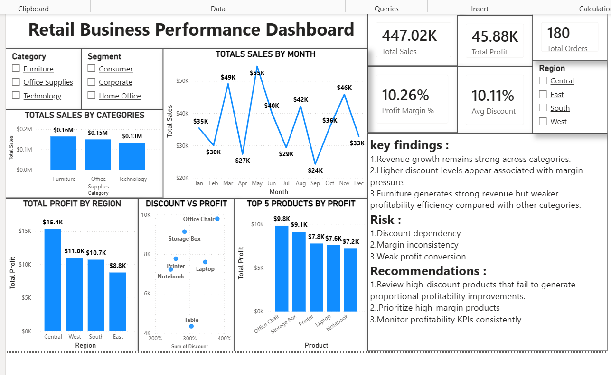

# Retail Business Performance & Profitability Analysis

## Project Overview

This project analyzes retail business performance to identify key factors impacting revenue, profitability, margins, and discount effectiveness.

The objective was to evaluate whether revenue growth is translating into sustainable profitability and to provide actionable business recommendations through data analysis and executive reporting.

---

## Business Problem

Revenue growth does not always result in stronger profitability.

This analysis investigates:

* Profitability by category
* Regional performance
* Discount impact on margins
* Product-level profitability
* Business risks affecting sustainable growth

---

## Dataset

Sample retail sales dataset containing:

* Order Date
* Region
* Segment
* Category
* Product
* Sales
* Profit
* Discount
* Quantity
* Profit Margin %

---

## Tools Used

* Microsoft Excel
* Power BI

---

## Key Performance Indicators (KPIs)

* Total Sales
* Total Profit
* Profit Margin %
* Average Discount
* Total Orders

---

## Key Findings

* Revenue growth remains strong across categories.
* Higher discount levels appear associated with margin pressure.
* Furniture generates strong revenue but weaker profitability efficiency.
* Certain products remain profitable despite discounting strategies.

---

## Business Risks

* Discount dependency
* Margin inconsistency
* Weak profit conversion

---

## Recommendations

* Review high-discount products that fail to generate proportional profitability improvements.
* Prioritize high-margin products.
* Monitor profitability KPIs consistently.

---

## Dashboard Preview
## Dashboard Preview

---

## Project Outcome

Developed an executive-style retail performance dashboard to evaluate profitability drivers, discount effectiveness, regional performance, and revenue sustainability through KPI reporting and business analysis.

The project demonstrates FP&A-oriented thinking, business performance evaluation, and executive reporting using Excel and Power BI.

